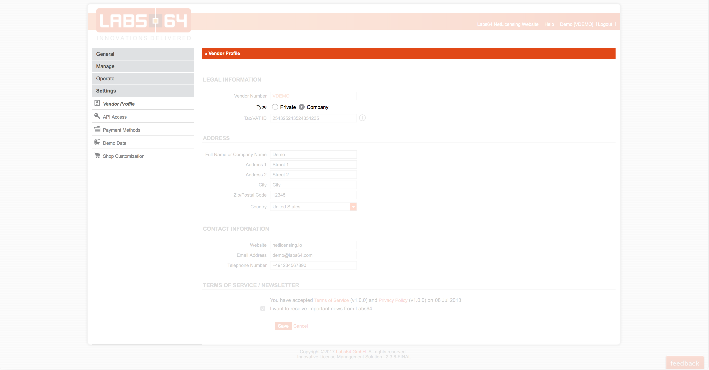
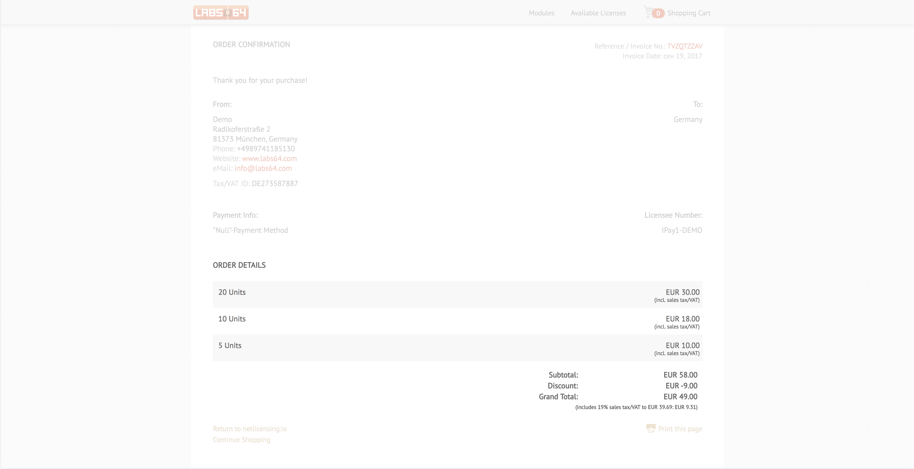
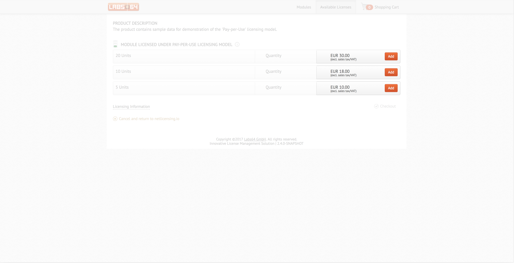
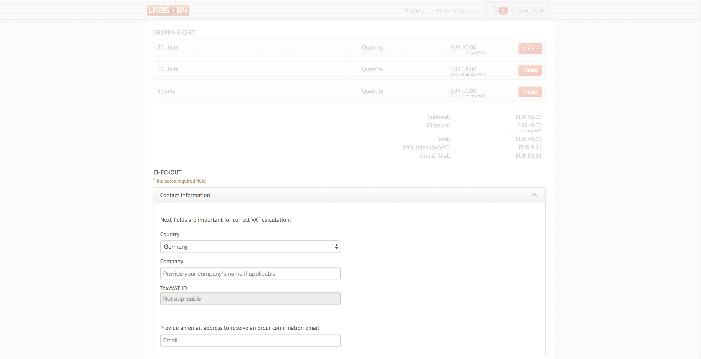

EU VAT Rules applicable since 2015
==================================

-   [General Info](#EUVATRulesapplicablesince2015-GeneralInfo)
-   [Implementation
    details](#EUVATRulesapplicablesince2015-Implementationdetails)
    -   [VAT
        Applicability](#EUVATRulesapplicablesince2015-VATApplicability)
    -   [VAT Calculation and Vendor
        Type](#EUVATRulesapplicablesince2015-VATCalculationandVendorType)
    -   [VAT Calculation and
        Product.](#EUVATRulesapplicablesince2015-VATCalculationandProduct.)
    -   [Shop and VAT Calculation
        Mode](#EUVATRulesapplicablesince2015-ShopandVATCalculationMode)
    -   [Changes to the Checkout
        Flow](#EUVATRulesapplicablesince2015-ChangestotheCheckoutFlow)

General Info
============

From January 1st, 2015, telecommunications, broadcasting and electronic
services are** always taxed in the country where the customer
belongs\*** – regardless of whether the customer is a business or
consumer – and regardless of whether the supplier is based in the EU or
outside.

*\* For a business (taxable person) = either the country where it is
registered or the country where it has fixed premises receiving the
service.*

*\* For a consumer (non-taxable person) = the country where they are
registered, have their permanent address or usually live.*

<a href="https://ec.europa.eu/taxation_customs/business/vat/telecommunications-broadcasting-electronic-services_en" class="external-link">More details</a>

Implementation details
======================

VAT Applicability
-----------------

Below table summarizes how we apply VAT, depending on transaction
participants and their location

Transaction participants

Seller country

Buyer country

VAT

Notes

C2C  
*Consumer to Consumer*

EU

EU

No VAT mention

 

EU

non-EU

No VAT mention

 

non-EU

EU

No VAT mention

 

non-EU

non-EU

No VAT mention

 

B2B  
**Business to *Business***

EU (country A)

EU (country B)

No VAT (RC)

customer must account for the tax (reverse-charge mechanism)

EU (country A)

EU (country A)

VAT

same country

EU

non-EU

No VAT

 

non-EU

EU

No VAT (RC)

customer must account for the tax (reverse-charge mechanism)

non-EU

non-EU

No VAT

 

B2C  
**Business to *Consumer***

EU

EU

VAT

 

EU

non-EU

No VAT

 

non-EU

EU

VAT

 

non-EU

non-EU

No VAT

 

\*  
*

VAT Calculation and Vendor Type
-------------------------------

Vat calculation depends on the vendor account type, which is
either **Private** or** **Company****:

-   **Private** - VAT is not
    applicable
-   **Company** - VAT is applied to all
    prices.

**Vendor type** is managed in the
<a href="https://go.netlicensing.io/console/v2/content/vendor/vendor.xhtml" class="external-link">Vendor Profile</a>
section of the NetLicensing Console:

VAT Calculation and Product.
----------------------------

For each product you can choose one of the two **Vat Calculation
Modes**:

1.  **Gross**: VAT is already included
    in the specified price\* 

2.  **Net**: VAT is not included in the
    specified price

*\* **Gross** mode is default for all new products and products created
prior to introduction of VAT handling.*

Icon

***Vat Calculation Mode **options may not be available in your pricing
plan!*

**Vat Calculation Mode** is managed via the Product Edit
in the NetLicensing
Console:

Shop and VAT Calculation Mode
-----------------------------

1.  **Gross** calculation mode implies that the VAT is already included
    in the specified price, which is reflected in the NetLicensing Shop
    as a corresponding note below the shown prices:  
      
    And VAT percentage and actual calculated amount shown on the
    checkout page as well as order confirmation:   
      
      

2.  **Net** calculation mode implies
    that the VAT is not included in the specified price and must be
    added on top of it, if necessary. Accordingly, NetLicensing Shop
    adds a note below the shown prices:  
      
    Shopping cart view and confirmation page shows calculated VAT as a
    separate field:   
      
    

Changes to the Checkout Flow
----------------------------

Checkout page includes new fields, required for the correct VAT
calculation:

-   Country
-   Company
-   Tax/VAT ID  
    
