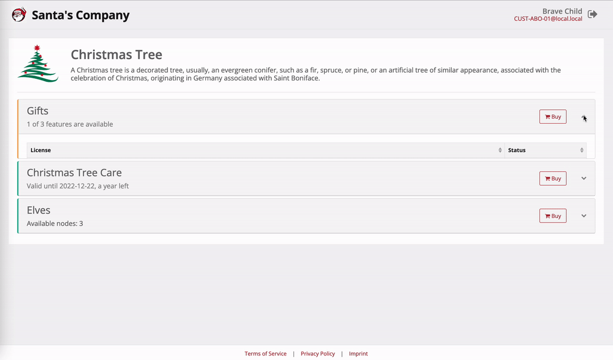

Customer Portal
===============

-   [Customer Portal Access](#customer-portal-access)
-   [Customization & Branding Options](#customization--branding-options)

NetLicensing Customer Portal is an online hosted page that works as a helpful tool for your customers to access their licensing information, such as licenses, transaction history, account information, vendor contact data, and many more options relevant to them.

NetLicensing Customer Portal allows you to white-label the entire license management experience within your website or product, using our API and hosted Customer Portal.

<a href="assets/images/changelog/netlicensing-customer-portal.gif" class="imagelink" data-lightbox="customer-portal" data-title="Customer Portal" data-alt="Customer Portal">
    
</a>

### Customer Portal Access

Note: Customer Portal can be used by vendors with the enabled feature *"Customer Portal"*.

You need to create a [token](token-services#create-token), to allow your customers to access Customer Portal.

<div>Request</div>
{: .code-example .ml-5 .code-header }
```http
POST https://go.netlicensing.io/core/v2/rest/token
tokenType=ACTION&action=licenseeLogin&licenseeNumber=I001-DEMO
Accept: application/xml
Content-Type: application/x-www-form-urlencoded
```
{: .ml-5 }

<div>Response</div>
{: .code-example .ml-5 .code-header }
```xml
 <?xml version="1.0" encoding="UTF-8" standalone="yes"?>
<ns2:netlicensing xmlns="http://www.w3.org/2000/09/xmldsig#" xmlns:ns2="http://netlicensing.labs64.com/schema/context">
  <ns2:infos/>
  <ns2:items>
    <ns2:item type="Token">
      <ns2:property name="number">83f4f4eb-4361-4978-a2a4-0bdb728d1386</ns2:property>
      <ns2:property name="active">true</ns2:property>
      <ns2:property name="expirationTime">2022-02-16T16:01:41.089Z</ns2:property>
      <ns2:property name="tokenType">ACTION</ns2:property>
      <ns2:property name="customerPortalURL">https://my.netlicensing.io/#/do/83f4f4eb-4361-4978-a2a4-0bdb728d1386/licenseeLogin</ns2:property>
      <ns2:property name="action">licenseeLogin</ns2:property>
      <ns2:property name="licenseeNumber">I001-DEMO</ns2:property>
      <ns2:property name="vendorNumber">VDEMO</ns2:property>
    </ns2:item>
  </ns2:items>
</ns2:netlicensing>
```
{: .ml-5 }

The value of the attribute `customerPortalURL` in the successful token create response need to be used to forward customer to hosted Customer Portal page.

### Customization & Branding Options

Customer Portal is a white-label solution and can be adjusted accordingly to your brand identity.

**Adjustable elements:**

- **Logo** - Vendor logo can be loaded at "Settings / Shop Customization". This logo will be shown in the Customer Portal header and open vendor card on click.
- **Accent colour** - Accent colour can be specified at "Settings / Shop Customization" as "Primary Color".
- **Vendor card** - Vendor card is opened on logo click and contains vendor data as it s filled at "Profile"
- **Legal information** - The valid URLs for the "Terms of Service", "Privacy Policy" and "Imprint" hyperlinks in the footer are being taken from "Profile / Legal Information (tab)".
- **Product information** - Product and product module details (such as Name, Description and Logo) can be provided for each configured product in the system.

Certain layout elements of the Customer Portal can be enabled or disabled by adding additional query parameters to the `customerPortalURL`:

| Query Param | Description    | Default |
|:------------|:---------------|:--------|
| header      | Disable header | `true`  |
| footer      | Disable footer | `true`  |
| shop        | Switch off payment buttons | `true` |

<div>Example</div>
{: .code-example .ml-5 .code-header }
```shell
https://my.netlicensing.io/#/do/TOKEN/licenseeLogin?header=false&footer=false&shop=false
```
{: .ml-5 }
