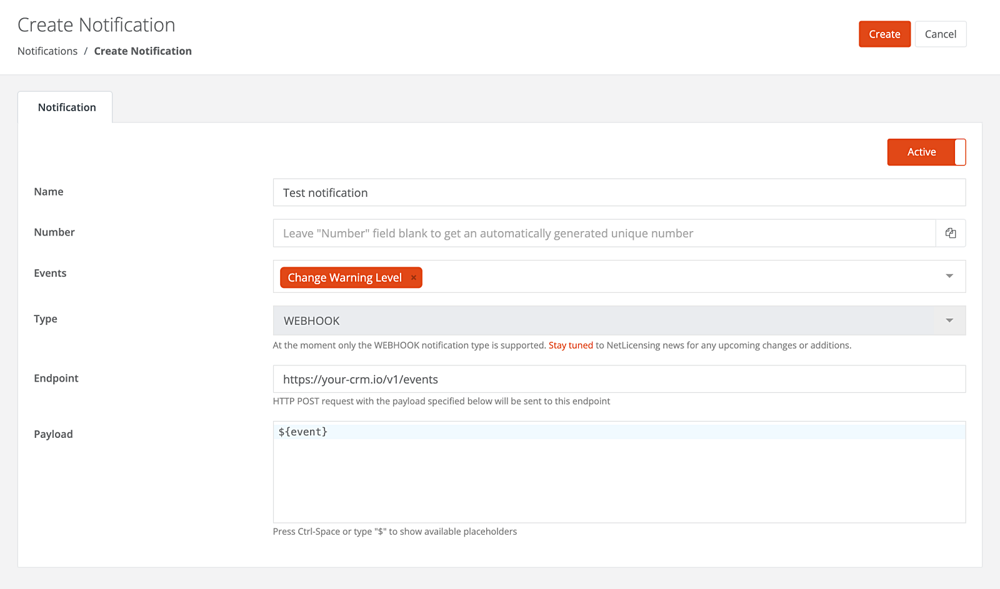

Notifications
=============

NetLicensing offers a Notifications feature that allows you to receive real-time notifications for specific events related to your vendor account. These notifications provide timely updates and alerts regarding the activities and statuses of your licenses and customers.

With the Notifications feature, you can set up endpoints to receive notifications for events such as:
- Creation of a new customer
- Issuance of a license
- Shop transaction created/changed
- Change in a customer’s warning level

These notifications are sent via HTTP POST requests to the specified endpoint URL, allowing you to integrate them into your systems or applications for further processing.

By leveraging the Notifications feature, you can automate your licensing workflows and streamline your business processes. You can use the notifications to trigger actions like sending automated emails to customers, updating internal databases or CRM systems, or generating reports based on events occurring within your licensing environment.

Setup
-----

Manage your NetLicensing Notifications from the *"Settings / Notifications"* section. Here, you can view, deactivate, delete, and create notifications.

### Creating a New Notification

1. Click on "Add Notification" to start the creation process
2. In the "Create Notification" view, fill in the required attributes
3. Click "Create" to create notification

<a href="assets/images/notifications.png" class="imagelink" data-lightbox="notifications" data-title="Notifications" data-alt="Notifications">
    
</a>

### Notification Attributes

- **Name**: The name of the notification.
- **Number**: A unique notification number. If left empty, a number will be generated automatically.
- **Events**: One or more events that will trigger the notification. Options include:
  - **Create Customer**: Triggered when a new customer is created.
  - **Create License**: Triggered when a new license is created.
  - **Payment Transaction Processed**: Triggered on NetLicensing Shop transaction status change.
  - **Change Warning Level**: Triggered on customer's [warning level](warning-level) changes (e.g., from `GREEN` to `YELLOW` or `YELLOW` to `RED`).
- **Type**: The type of notification. Currently, only `WEBHOOK` is supported.
- **Endpoint**: The URL where an HTTP POST request with the specified payload will be sent. **Note:** The endpoint must use the secured HTTPS protocol with a public SSL/TLS certificate.
- **Payload**: The specific payload for the event can be defined here.

Payload Structure
-----------------

Notification payload can be configured to include specific data related to the event that triggered the notification. The payload is sent as a JSON object in the body of the HTTP POST request to the specified endpoint URL. The structure of the payload depends on the event type and the data associated with the event.

The standard payload structure includes the following fields:

- **Notification**: `{$}` - full notification data
- **Timestamp**: `{$.timestamp}` - timestamp of the notification
- **Origin**: `{$.origin}` - can be one of the following: `Notification`
- **Entities**: `{$.entities}` - notification-specific data
- **Name**: `{$.entities.Event[0].name}` - notification name; can be one of the following: `LICENSEE_CREATED`, `LICENSE_CREATED`, `WARNING_LEVEL_CHANGED`, `PAYMENT_TRANSACTION_PROCESSED`

Below are examples of the payload structure (`{$}` element) for different notification types:

<div>LICENSEE_CREATED</div>
{: .code-example .ml-5 .code-header }
```json
{
    "timestamp": "2024-09-19T04:29:47.445Z",
    "origin": "Notification",
    "entities": {
        "Event": [
            {
                "name": "LICENSEE_CREATED"
            }
        ],
        "Licensee": [
            {
                "number": "IKWUYQ9GR",
                "active": true,
                "licenseeSecret": "",
                "warningLevelSummary": {
                    "RED": [],
                    "YELLOW": [],
                    "GREEN": []
                },
                "name": "Customer Uno",
                "markedForTransfer": "false",
                "products": [
                    "PEP4ZQ6MV"
                ]
            }
        ]
    }
}
```
{: .ml-5 }


<div>LICENSE_CREATED</div>
{: .code-example .ml-5 .code-header }
```json
{
    "timestamp": "2024-09-19T04:30:26.006Z",
    "origin": "Notification",
    "entities": {
        "Event": [
            {
                "name": "LICENSE_CREATED"
            }
        ],
        "License": [
            {
                "number": "LN2TD47QY",
                "active": true,
                "currency": "EUR",
                "price": 0,
                "hidden": false,
                "gracePeriod": "false",
                "timeVolumePeriod": "MONTH",
                "timeVolume": "3",
                "startDate": "2024-09-19T04:30:26.004Z",
                "licensee": "IKWUYQ9GR",
                "licenseTemplate": "E27NV3IQD"
            }
        ]
    }
}
```
{: .ml-5 }

<div>PAYMENT_TRANSACTION_PROCESSED</div>
{: .code-example .ml-5 .code-header }
```json
{
    "timestamp": "2025-03-24T13:31:14.532Z",
    "origin": "Notification",
    "entities": {
        "Event": [
            {
                "name": "PAYMENT_TRANSACTION_PROCESSED"
            }
        ],
        "Transaction": [
            {
                "number": "TET7WUW3Y",
                "active": true,
                "source": "SHOP",
                "status": "CLOSED",
                "price": 10,
                "discount": 0,
                "currency": "EUR",
                "inUse": true,
                "datecreated": "2025-03-24T13:31:14.531Z",
                "dateclosed": "2025-03-24T13:31:14.531Z",
                "vatMode": "GROSS",
                "totalExcludingVat": "0.00",
                "isSubjectToVat": "false",
                "isReverseCharge": "false",
                "subTotal": "0.00",
                "vatPercent": "0",
                "vatAmount": "0.00",
                "consentTimestamp": "2025-03-24T13:31:13.162Z",
                "consentTermsOfServiceURL": "https://en.wikipedia.org/wiki/North_Pole#terms",
                "paymentMethodNumber": "NULL",
                "vendorCountryCode": "DE",
                "countryCode": "BW",
                "paymentMethod": "STRIPE",
                "consentPrivacyPolicyURL": "https://en.wikipedia.org/wiki/North_Pole#privacy",
                "licenses": [
                    "LQZ2GAKTZ"
                ]
            }
        ]
    }
}
```
{: .ml-5 }

<div>WARNING_LEVEL_CHANGED</div>
{: .code-example .ml-5 .code-header }
```json
{
    "timestamp": "2024-09-19T04:30:57.709Z",
    "origin": "Notification",
    "entities": {
        "Event": [
            {
                "name": "WARNING_LEVEL_CHANGED"
            }
        ],
        "Licensee": [
            {
                "number": "IKWUYQ9GR",
                "active": true,
                "licenseeSecret": "",
                "warningLevelSummary": {
                    "RED": [
                        "MW53JJ3RY",
                        "MCJZGAMXS"
                    ],
                    "YELLOW": [],
                    "GREEN": [
                        "MVEMJ5P9D"
                    ]
                },
                "name": "Customer Uno",
                "markedForTransfer": "false",
                "products": [
                    "PEP4ZQ6MV"
                ],
                "licenses": [
                    "LN2TD47QY"
                ]
            }
        ],
        "ProductModuleValidation": [
            {
                "productModuleNumber": "MW53JJ3RY",
                "valid": "false",
                "productModuleName": "Subscription",
                "warningLevel": "RED",
                "licensingModel": "Subscription"
            },
            {
                "productModuleNumber": "MCJZGAMXS",
                "valid": "false",
                "productModuleName": "Maintenance",
                "warningLevel": "RED",
                "licensingModel": "Subscription"
            },
            {
                "productModuleNumber": "MVEMJ5P9D",
                "valid": "true",
                "expires": "2024-12-19T04:30:26.004Z",
                "productModuleName": "Support",
                "warningLevel": "GREEN",
                "licensingModel": "Subscription"
            }
        ]
    }
}
```
{: .ml-5 }

Considerations and Best Practices for Receiving Notifications
-------------------------------------------------------------

When building an application to receive notifications, consider the following factors:

1. **Reliability**: Notification delivery is not always guaranteed due to factors such as network issues, server errors, or application downtime. Implement retry mechanisms and idempotency to handle missed or duplicate notifications.

2. **Security**: Ensure secure connections using encryption protocols, such as TLS, to protect the integrity and confidentiality of the data transmitted via notifications. Validate the source of the notifications by checking signatures or using secret keys.

3. **Scalability**: Design your notifications receiver to handle varying loads. Use asynchronous processing to manage high volumes of incoming notifications efficiently.

4. **Logging and Monitoring**: Implement comprehensive logging and monitoring to track notifications deliveries and failures. This helps in diagnosing issues and improving the reliability of your notification handling.

5. **Validation**: Validate incoming notification data to ensure it adheres to the expected format and contains all necessary information. This helps prevent the processing of invalid or malicious data.

6. **Versioning**: Plan for versioning of your notifications endpoint(-s) to accommodate future changes without disrupting existing integrations. Ensure backward compatibility whenever possible.
